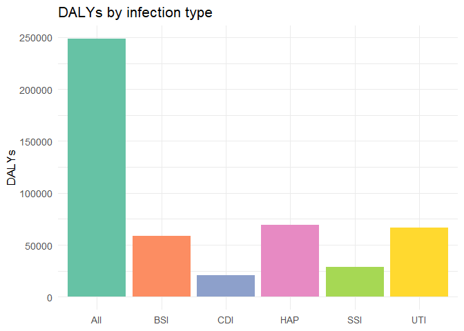

<!-- README.md is generated from README.Rmd. Please edit this file. -->

# assignment4.xinlei.luo

An R package that ships example datasets on **healthcare-associated
infections (HAIs)** in Germany and an interactive **Shiny app** to
explore the burden by infection type or sample.

## What’s inside

- Packaged CSV datasets under inst/extdata/ (hai_table1, hai_table2)

- Utility functions

  - list_hai_datasets() – list available datasets in the package

  - read_hai_dataset(name) – read a dataset into a tidy data frame
    *(returns columns: infection_type, sample, cases, deaths, daly)*

  - summarise_hai(df, by, metric) – summarise totals by a grouping

  - run_app() – launch the interactive Shiny explorer

- A vignette: Getting Started: Germany HAI Burden Explorer

## Metric definitions

- **cases** – number of HAI infections

- **deaths** – number of deaths attributable to HAI

- **daly** – disability-adjusted life years (YLL + YLD), a composite
  burden metric

## Installation

You can install the development version of `assignment4.xinlei.luo` from
[GitHub](https://github.com) with:

``` r
# install.packages("devtools")
devtools::install_github("ETC5523-2025/assignment-4-packages-and-shiny-apps-XINLEI-LUO")
#> ── R CMD build ─────────────────────────────────────────────────────────────────
#>          checking for file 'C:\Users\leah\AppData\Local\Temp\RtmpILe86r\remotesda88297f5dcb\ETC5523-2025-assignment-4-packages-and-shiny-apps-XINLEI-LUO-84a0410/DESCRIPTION' ...  ✔  checking for file 'C:\Users\leah\AppData\Local\Temp\RtmpILe86r\remotesda88297f5dcb\ETC5523-2025-assignment-4-packages-and-shiny-apps-XINLEI-LUO-84a0410/DESCRIPTION'
#>       ─  preparing 'assignment4.xinlei.luo':
#>    checking DESCRIPTION meta-information ...  ✔  checking DESCRIPTION meta-information
#>       ─  checking for LF line-endings in source and make files and shell scripts
#>   ─  checking for empty or unneeded directories
#>       ─  building 'assignment4.xinlei.luo_0.0.0.9000.tar.gz'
#>      
#> 
```

*(If you prefer remotes, use remotes::install_github().)*

## Data included

List packaged datasets:

``` r
list_hai_datasets()
#> [1] "hai_table1" "hai_table2"
```

Read one:

``` r
df1 <- read_hai_dataset("hai_table1")
head(df1)
#>   infection_type     sample  cases deaths   daly
#> 1            HAP German_PPS 106586   3968  69508
#> 2            SSI German_PPS  93222   2328  28842
#> 3            BSI German_PPS  26976   3905  58350
#> 4            UTI German_PPS 214150   3664  66701
#> 5            CDI German_PPS  36002   1917  20890
#> 6            All German_PPS 478222  16245 248920
```

*Note: If a dataset originally lacks sample, the reader fills it with
“German_PPS” for consistency.*

## Quick summaries

Summarise **DALYs** by infection type:

``` r
smry_by_type <- summarise_hai(df1, by = "infection_type", metric = "daly")
smry_by_type
#> # A tibble: 6 × 2
#>   group  value
#>   <chr>  <dbl>
#> 1 All   248920
#> 2 HAP    69508
#> 3 UTI    66701
#> 4 BSI    58350
#> 5 SSI    28842
#> 6 CDI    20890
```

If the dataset contains multiple samples, you can summarise by sample
too:

``` r
df2 <- read_hai_dataset("hai_table2")
smry_by_sample <- summarise_hai(df2, by = "sample", metric = "cases")
smry_by_sample
#> # A tibble: 3 × 2
#>   group              value
#>   <chr>              <dbl>
#> 1 German_convenience 1271.
#> 2 German_PPS         1183.
#> 3 ECDC_PPS_EU_EEA     936.
```

## Example plot

``` r
library(ggplot2)

ggplot(smry_by_type, aes(group, value, fill = group)) +
geom_col() +
scale_fill_brewer(palette = "Set2") +
labs(x = NULL, y = "DALYs", title = "DALYs by infection type") +
theme_minimal(base_size = 13) +
theme(legend.position = "none")
```



## Shiny app

Launch the interactive explorer:

``` r
run_app()
```

The app lets you:

1.Choose dataset (hai_table1, hai_table2)

2.Pick a metric (cases, deaths, daly)

3.Group by infection_type or sample

4.View a bar chart of totals (sums)

## Documentation website

If you enabled pkgdown + GitHub Actions, the site will be published at:

- Site:
  <https://ETC5523-2025.github.io/assignment-4-packages-and-shiny-apps-XINLEI-LUO/>

(Replace the URL above if your repository/org name differs.)

## Development

- Generate docs: devtools::document()

- Build README: devtools::build_readme()

- Run checks: devtools::check()

- Build site: pkgdown::build_site()

## License

MIT @ Xinlei Luo

## Reproducibility

``` r
sessionInfo()
#> R version 4.4.2 (2024-10-31 ucrt)
#> Platform: x86_64-w64-mingw32/x64
#> Running under: Windows 11 x64 (build 26200)
#> 
#> Matrix products: default
#> 
#> 
#> locale:
#> [1] LC_COLLATE=Chinese (Simplified)_China.utf8 
#> [2] LC_CTYPE=Chinese (Simplified)_China.utf8   
#> [3] LC_MONETARY=Chinese (Simplified)_China.utf8
#> [4] LC_NUMERIC=C                               
#> [5] LC_TIME=Chinese (Simplified)_China.utf8    
#> 
#> time zone: Australia/Sydney
#> tzcode source: internal
#> 
#> attached base packages:
#> [1] stats     graphics  grDevices utils     datasets  methods   base     
#> 
#> other attached packages:
#> [1] ggplot2_4.0.0                assignment4.xinlei.luo_0.0.1
#> 
#> loaded via a namespace (and not attached):
#>  [1] gtable_0.3.6       dplyr_1.1.4        compiler_4.4.2     tidyselect_1.2.1  
#>  [5] callr_3.7.6        tidyr_1.3.1        scales_1.4.0       yaml_2.3.10       
#>  [9] fastmap_1.2.0      R6_2.6.1           labeling_0.4.3     generics_0.1.4    
#> [13] curl_6.2.1         knitr_1.49         tibble_3.2.1       desc_1.4.3        
#> [17] RColorBrewer_1.1-3 pillar_1.10.1      rlang_1.1.6        utf8_1.2.4        
#> [21] cachem_1.1.0       xfun_0.52          S7_0.2.0           fs_1.6.6          
#> [25] pkgload_1.4.1      memoise_2.0.1      cli_3.6.5          withr_3.0.2       
#> [29] magrittr_2.0.3     ps_1.9.0           grid_4.4.2         digest_0.6.37     
#> [33] processx_3.8.6     rstudioapi_0.17.1  remotes_2.5.0      devtools_2.4.6    
#> [37] lifecycle_1.0.4    vctrs_0.6.5        evaluate_1.0.3     glue_1.8.0        
#> [41] farver_2.1.2       sessioninfo_1.2.3  pkgbuild_1.4.8     rmarkdown_2.29    
#> [45] purrr_1.0.4        tools_4.4.2        usethis_3.2.1      pkgconfig_2.0.3   
#> [49] ellipsis_0.3.2     htmltools_0.5.8.1
```
